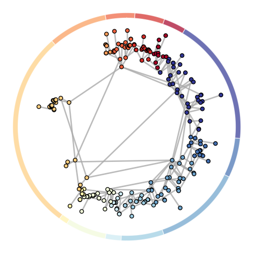

# dyvider

**dyvider** is a small package implementing dynamic programming algorithms for exact linear clustering in networks.
Its algorithms process networks whose nodes have positions in one dimension, and return their optimal partition.

The theory and experiments exploring this code can be found in the paper [\"Exact and rapid linear clustering of networks with dynamic programming\"](https://arxiv.org/abs/2301.10403), by [Alice Patania](https://alpatania.github.io/), [Antoine Allard](https://antoineallard.github.io/) and [Jean-Gabriel Young](https://jg-you.github.io/).





## Dependencies

Python 3.10 or newer is required. The only runtime dependencies are
[`networkx`](https://networkx.org/) and `numpy`.

## Installation

To add the latest release of dyvider to a uv project:
```sh
uv add dyvider
```

You can also install it locally with `pip install dyvider`.

## Development

Install [uv](https://docs.astral.sh/uv/getting-started/installation/), then clone this repository and create the development environment:

```sh
git clone https://github.com/jg-you/dyvider.git
cd dyvider
uv sync --locked
uv run pytest
```

`uv sync` installs dyvider in editable mode and includes the development dependencies. 

To work through the notebook, install the optional tutorial dependencies:

```sh
uv sync --locked --extra tutorial
uv run --extra tutorial jupyter lab tutorial.ipynb
```

To build the wheel and source distribution:

```sh
uv build
```

For development without uv, use `pip install -e . pytest`.

## Quick tour

The following minimal example first assigns scores to nodes with a one-dimensional spectral embedding and then retrieves an optimal linear clustering from this embedding using `dyvider`.

```python
import networkx as nx
import dyvider as dy
import numpy as np

# create a graph
g = nx.stochastic_block_model([10, 10], [[0.5, 0.05], [0.05, 0.5]], seed=42)

# generate a 1-d embedding from an eigenvector of the adjacency matrix
eigenvals, eigvenvecs = np.linalg.eig(nx.to_numpy_array(g))
score = {v: float(eigvenvecs[v, 0]) for v in g.nodes()}

# set the node positions
nx.set_node_attributes(g, score, 'score')

# run dyvider
g = dy.utilities.preprocess(g)
objective_function = dy.objectives.Modularity()
solution, Q = dy.algorithms.run(g, objective_function)

print(solution)
```

The expected output is:

```python
>>> [[0, 1, 2, 3, 4, 5, 6, 7, 8, 9]; [10, 11, 12, 13, 14, 15, 16, 17, 18, 19]] 
```

Our [tutorial](tutorial.ipynb) goes into more detail and demonstrates all the API calls.


## Paper

If you use this code, please consider citing:

"[*Exact and rapid linear clustering of networks with dynamic programming*](https://arxiv.org/abs/2301.10403)"<br/>
[Alice Patania](https://alpatania.github.io/), [Antoine Allard](https://antoineallard.github.io/) and [Jean-Gabriel Young](https://jg-you.github.io/). <br/>
arXiv:2301.10403 <br/>


## Author information

Code by [Jean-Gabriel Young](https://jg-you.github.io). Don't hesitate to get in touch at <jean-gabriel.young@uvm.edu>, or via the [issues](https://github.com/jg-you/dyvider/issues)!
